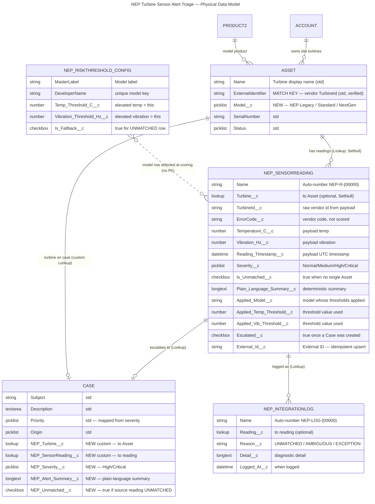

# Technical Design — Logical & Physical Data Model + ERD

**Project:** Nordic EcoPower SEAP — Turbine Sensor Alert Triage
**Client:** Nordic EcoPower (NEP)
**Platform:** Salesforce Service Cloud (NEP's existing org — Agentforce Service edition)
**Phase:** Architecture & Design (Design and Model)
**Prepared on:** 2026-10-06
**Status:** Draft for review
**Persona framing:** Solution Architect — Well-Architected (Trusted · Easy · Adaptable). Every object/field traces to a requirement (FR/NFR) and to a verified org fact; declarative-first unless a named limit forces otherwise.

---

## 0. Scope of this document

This is the **data-model slice** of the Technical Design: the logical and physical model, the ERD, and a field-level data dictionary for everything this capability introduces. It specifies **what is created and how it relates** — it does **not** author deployable source (that is the Agentic Build platform's job), and it is **not** the automation/trigger design, the Flexipage design, or the test plan (those are their own TDD slices).

The one decision confirmed this turn and now baked into the model: because the org has **no standard `Case.AssetId`**, the escalation Case links to the turbine via a **custom `Case → Asset` lookup** and to the originating reading via a **custom `Case → Reading` lookup**.

---

## 1. Grounding — what the live org actually shows (verified this phase)

The model below is built on org facts confirmed by live `org_field_lookup` this phase, not on remembered state:

| Org fact | Result | Consequence for the model |
|---|---|---|
| `Asset.ExternalIdentifier` | **Present** · type `string` · writable | It is the match key (FR-01). No new field needed for matching; it becomes a candidate External ID target for upsert. |
| `Asset.Model` | **Absent** | Must be **created** as a new field — it drives per-model threshold selection (FR-08). |
| `Case.AssetId` | **Absent** (standard Case→Asset relationship not enabled) | A **custom** `Case → Asset` lookup must be created; the standard field cannot be relied on (confirmed decision this turn). |
| `NEP_*` custom objects / threshold / reading entities | **None exist** | Clean greenfield — `NEP_SensorReading__c`, the config CMDT and the log object are all new; nothing to collide with. |

> 🔴 **Blocker — fleet population of `Asset.ExternalIdentifier` (O-01 / A-02 / R-04).** The field *exists* and is verified; whether NEP's turbine Assets actually *carry* the vendor `TurbineId` value in it today is a **data-readiness** question only real Asset records answer. If it is unpopulated at go-live, FR-01 matching has nothing to match against and the fleet defaults to the UNMATCHED path (mass-UNMATCHED, R-04). This cannot go to production unresolved. Owner: Asset-population integration owner [TBD] + NEP Admin.

---

## 2. Logical data model — the entities and why each exists

| Entity | Kind | Purpose | Primary source |
|---|---|---|---|
| **Asset** (standard) | Existing | The physical turbine. Carries the match key (`ExternalIdentifier`) and the new `Model` field that selects which thresholds apply. | FR-01, FR-05, FR-08; BR §1/§2 |
| **NEP_SensorReading__c** | New custom object | One inbound reading — the per-turbine history record. Holds raw payload, matched Asset, computed severity, summary, UNMATCHED flag, applied-threshold context, and the external ID for idempotent upsert. | FR-02/04/05/06/07/09/12/23; NFR-05/09 |
| **NEP_RiskThreshold_Config__mdt** | New Custom Metadata Type | The per-model threshold table as **configuration, not code** — one row per model (NEP-Legacy / NEP-Standard / NEP-NextGen) plus the UNMATCHED fallback row. Editable without a deploy; packageable. | FR-10/11; NFR-06; C-4 |
| **Case** (standard) | Existing | The escalation record created for High/Critical readings, owned by the Field Response Queue. Gains two **custom** lookups (to Asset and to Reading) plus severity/summary carrier fields. | FR-15/16/17/18/21; DL-01/DL-02 |
| **NEP_IntegrationLog__c** | New custom object | Exception / UNMATCHED log so no reading is silently dropped and ambiguous/unmatched conditions are discoverable. | FR-02/03/23 |

**Why a custom object (`NEP_SensorReading__c`) and not a child of Asset via junction, or BigObject?**
- A standard-to-standard junction doesn't fit — the reading is a first-class history record with its own lifecycle (score, summarise, escalate), not merely a many-to-many link.
- A **BigObject** was considered for high-volume history but rejected for release 1: BigObjects don't support triggers (the scoring/escalation automation couldn't fire on insert), don't support standard page related-lists the way FR-05/FR-20 need, and can't carry the lookups to Case. A standard custom object with an archiving strategy (noted in §8) is the Trusted/Adaptable choice; LDV handling is a scalability item, not a reason to lose the automation surface.

---

## 3. Relationship design — the decisions that matter

| Relationship | Type | Rationale (Well-Architected) |
|---|---|---|
| `NEP_SensorReading__c → Asset` | **Lookup** (optional, not master-detail) | Must be **optional** because an UNMATCHED reading has no Asset and must still be retained and scored (FR-02/FR-09). Master-detail would forbid a null parent, which directly breaks the "never silently drop" rule. Lookup also avoids forcing the reading's sharing/ownership to follow Asset. |
| `NEP_SensorReading__c → Asset` behaviour on delete | `SetNull` (don't cascade) | A turbine Asset being removed must not vaporise its historical readings — history is the whole point of FR-04 ("did we see this coming?"). |
| `Case → Asset` (**custom** `NEP_Turbine__c`) | **Lookup** (custom) | Standard `Case.AssetId` is absent (verified) — confirmed this turn. Custom lookup gives the responder the turbine link (FR-16) without enabling the full standard Assets-on-Case feature NEP hasn't turned on. |
| `Case → NEP_SensorReading__c` (**custom** `NEP_SensorReading__c`) | **Lookup** (custom) | Links the Case back to the exact originating reading (FR-16/FR-21) so the responder has context without hunting. Optional (a Case could in principle exist without a reading in future), but always populated by the escalation path. |
| `NEP_IntegrationLog__c → NEP_SensorReading__c` | **Lookup** (optional) | Ties a log entry to the reading that caused it (FR-23) where one exists; optional because some exceptions may predate a reading record. |
| `Asset → Account` / `Asset → Product2` | Standard, unchanged | FR-22 (Assets reachable from Account) and model-vs-Product are satisfied by existing standard relationships — no change. |

**Lookup vs. master-detail, stated plainly:** every new relationship here is a **lookup**. The master-detail candidates (reading→Asset, Case→reading) all fail the master-detail test because the child must be able to exist without the parent (UNMATCHED readings; and we never want cascade-delete of history or Cases). Choosing lookup is the Trusted decision — it preserves retention guarantees — at the cost of rollup-summary fields, which this release does not need on Asset.

---

## 4. ERD

> Note on `NEP_RiskThreshold_Config__mdt`: a Custom Metadata Type has **no foreign-key relationship** to records. The scoring service reads the matching model row at runtime by `DeveloperName`/`Model`; the dotted line in the ERD denotes that runtime selection, not a database FK. The *applied* values are then stamped onto the reading (`Applied_*`) so history is self-describing (FR-12).

---

## 5. Field-level data dictionary

### 5.1 Asset (standard) — one new field

| API Name | Label | Type | Req | Notes & source |
|---|---|---|---|---|
| `Model__c` | Turbine Model | Picklist | Yes (for turbines) | Values: `NEP-Legacy`, `NEP-Standard`, `NEP-NextGen`. Drives threshold selection (FR-08). Values must align exactly with `NEP_RiskThreshold_Config__mdt.DeveloperName`. 🟡 Required before UAT: populate `Model__c` on test turbine Assets or every reading scores on fallback. |
| `ExternalIdentifier` | External Identifier | String (std) | — | **Existing, verified.** Match key for FR-01. No change to the field; its *population* is the 🔴 blocker in §1. |

### 5.2 NEP_SensorReading__c (new object)

Object settings: Auto-number Name `NEP-R-{00000}`, Reports enabled, Activities off, Field History Tracking **on** for `Severity__c` and the `Applied_*` fields (supports FR-12 traceability within the standard 18-month tracking window; richer audit is W-07, out of scope).

| API Name | Label | Type | Req | External ID / Unique | Notes & source |
|---|---|---|---|---|---|
| `External_Id__c` | External ID | Text(255) | Yes | **External ID + Unique (case-insensitive)** | Idempotent upsert / dedupe key (NFR-05, NFR-09, C-9/C-10). Set by the integration from a stable payload key (e.g. TurbineId+Timestamp). Re-loading the same reading upserts, never duplicates. |
| `Turbine__c` | Turbine | Lookup(Asset) | No | — | Optional on purpose — UNMATCHED readings have none (FR-02/09). Delete behaviour `SetNull` (preserve history). |
| `TurbineId__c` | Turbine Id (raw) | Text(80) | Yes | — | Raw vendor id from payload, retained even when unmatched so the match can be retried/audited (FR-02). |
| `ErrorCode__c` | Error Code | Text(80) | No | — | Vendor diagnostic code; **captured, not scored** (per Data & Threshold Reqs v3 §1). |
| `Temperature_C__c` | Temperature (°C) | Number(6,2) | Yes | — | Payload temperature; scored against the applied temp threshold (FR-07). |
| `Vibration_Hz__c` | Vibration (Hz) | Number(6,2) | Yes | — | Payload vibration; scored against the applied vibration threshold (FR-07). |
| `Reading_Timestamp__c` | Reading Timestamp | DateTime | Yes | — | Payload UTC timestamp; orders the per-turbine history (FR-05). |
| `Severity__c` | Severity | Picklist | Yes (set by automation) | — | Values `Normal`, `Medium`, `High`, `Critical`. Computed deterministically (FR-06/07, NFR-01). |
| `Is_Unmatched__c` | Unmatched | Checkbox | — | — | True when no single Asset matched (FR-02/03). Default false. |
| `Plain_Language_Summary__c` | Plain-Language Summary | Long Text Area(2000) | No | — | Deterministic, non-GenAI summary for High/Critical (FR-13/14, NFR-02). Null for Normal/Medium. |
| `Applied_Model__c` | Applied Model | Text(40) | No | — | The model whose thresholds were used (`NEP-Legacy`…/`UNMATCHED`). Captures *which* row judged this reading (FR-12). |
| `Applied_Temp_Threshold__c` | Applied Temp Threshold (°C) | Number(6,2) | No | — | The temp threshold value in force at scoring time (FR-12) — so a later config change doesn't retroactively obscure the judgement. |
| `Applied_Vib_Threshold__c` | Applied Vibration Threshold (Hz) | Number(6,2) | No | — | The vibration threshold value in force at scoring time (FR-12). |
| `Escalated__c` | Escalated | Checkbox | — | — | True once a Case has been created from this reading — the idempotency guard against duplicate Cases (NFR-05). Default false. |

### 5.3 NEP_RiskThreshold_Config__mdt (new Custom Metadata Type)

Four seed rows: `NEP-Legacy`, `NEP-Standard`, `NEP-NextGen`, `UNMATCHED` — values exactly from Data & Threshold Reqs v3 §2. CMDT chosen over Custom Setting because it is **deployable, packageable, and versioned with the metadata** while remaining editable in Setup without code (FR-10/11, NFR-06).

| API Name | Label | Type | Notes & source |
|---|---|---|---|
| `DeveloperName` | (std CMDT key) | — | Unique model key; must match `Asset.Model__c` values. UNMATCHED row keyed `UNMATCHED`. |
| `MasterLabel` | (std CMDT label) | — | Human-readable model label. |
| `Temp_Threshold_C__c` | Elevated Temp Threshold (°C) | Number(6,2) | "Elevated" means value **> this** (strictly greater, per v3 "> 80 °C"). Legacy 90 / Standard 80 / NextGen 75 / UNMATCHED 90. |
| `Vibration_Threshold_Hz__c` | Elevated Vibration Threshold (Hz) | Number(6,2) | Value **> this**. Legacy 45 / Standard 50 / NextGen 55 / UNMATCHED 45. |
| `Is_Fallback__c` | Fallback (UNMATCHED) | Checkbox | True only on the UNMATCHED row — lets the service pick the fallback deterministically without a hardcoded name (FR-09). |

**Seed data (from Data & Threshold Requirements v3 §2 — not invented):**

| DeveloperName | Temp_Threshold_C__c | Vibration_Threshold_Hz__c | Is_Fallback__c |
|---|---|---|---|
| NEP-Legacy | 90 | 45 | false |
| NEP-Standard | 80 | 50 | false |
| NEP-NextGen | 75 | 55 | false |
| UNMATCHED | 90 | 45 | true |

### 5.4 Case (standard) — new custom fields

Standard fields (`Subject`, `Description`, `Priority`, `Origin`, `Status`) are reused — the automation populates `Subject`/`Description` from severity+summary and maps severity to standard `Priority`. New custom fields:

| API Name | Label | Type | Req | Notes & source |
|---|---|---|---|---|
| `NEP_Turbine__c` | Turbine | Lookup(Asset) | No | **Confirmed custom lookup** — stands in for the absent standard `Case.AssetId` (FR-16). Null for UNMATCHED-sourced Cases. |
| `NEP_SensorReading__c` | Source Reading | Lookup(NEP_SensorReading__c) | No | Links back to the originating reading (FR-16/21). Always populated by the escalation path. |
| `NEP_Severity__c` | Alert Severity | Picklist | No | `High` / `Critical` only (Normal/Medium never escalate — FR-19). Mirrors the reading's severity for list-view/report use. |
| `NEP_Alert_Summary__c` | Alert Summary | Long Text Area(2000) | No | The plain-language summary surfaced on the Case (FR-16/21). |
| `NEP_Unmatched__c` | From Unmatched Reading | Checkbox | — | True when the source reading was UNMATCHED (FR-17) — makes UNMATCHED escalations filterable by the response team. |

### 5.5 NEP_IntegrationLog__c (new object)

Object settings: Auto-number Name `NEP-LOG-{00000}`, Reports enabled.

| API Name | Label | Type | Req | Notes & source |
|---|---|---|---|---|
| `Reading__c` | Reading | Lookup(NEP_SensorReading__c) | No | The reading this entry concerns, where one exists (FR-23). |
| `Reason__c` | Reason | Picklist | Yes | `UNMATCHED` / `AMBIGUOUS` / `EXCEPTION` — classifies the follow-up (FR-02/03/23). |
| `Detail__c` | Detail | Long Text Area(2000) | No | Diagnostic detail (e.g. "TurbineId X matched 2 Assets"). |
| `Logged_At__c` | Logged At | DateTime | Yes | When the entry was written. |

> Baseline per FR-23; O-04 leaves richer exception-logging patterns as a design conversation that **must not block build**. This object is the committed baseline.

---

## 6. External IDs, uniqueness & idempotency (NFR-05 / NFR-09)

- **`NEP_SensorReading__c.External_Id__c`** is the single idempotency anchor: marked **External ID + Unique**, it lets the integration *upsert* readings so a replayed payload updates rather than duplicates (NFR-05/09, C-9/C-10). The integration owns composing a stable key (recommended: `TurbineId + '|' + Reading_Timestamp` — a design input for the integration slice, not fixed here).
- **Duplicate escalation** is prevented at the automation layer, not the schema: `Escalated__c` is the guard — the escalation step only creates a Case when `Escalated__c = false`, then sets it true in the same transaction (detailed in the automation TDD slice). Called out here because the field exists *for* that guard.
- **`Asset.ExternalIdentifier`** is the match key, not a reading key — it is the join target, not the dedupe anchor for readings.

---

## 7. Security, FLS & sharing posture (NFR-08 / C-7)

The deliverable is the data model, so this is the **access shape** of the model; the full sharing/permission-set design is its own slice. The model-level decisions:

| Decision | Choice | Rationale |
|---|---|---|
| Admin access at creation | **Grant object access + FLS to System Administrator at deploy time** for every new object/field (NFR-08, C-7). | Avoids the "field not visible/access denied" state the moment it deploys — a hard NEP constraint. |
| OWD — `NEP_SensorReading__c` | **Private** (recommended) with access via permission set to operations/service users | Readings relate to specific turbines/sites; Private + permission-set grant is the Trusted default. Confirm against NEP's existing Asset OWD in the sharing slice. |
| OWD — `NEP_IntegrationLog__c` | **Private**, admin/ops visibility | Exception data is operational, not broadly shared. |
| New Case fields FLS | Visible to the Field Response Queue members and service users | So the responder actually sees severity/summary/links (FR-21). |
| Field-level encryption / Shield | **Not in scope** (W-07) | No Shield in release 1; sensor telemetry is not classified PII. |
| Threshold edit rights | Restricted to authorized staff (CMDT edit is an admin-level Setup action) | FR-11 — "authorized staff can revise" is satisfied by CMDT being Setup-gated; no custom permission needed in release 1. |

> 🟡 Required before UAT: confirm the chosen OWD for `NEP_SensorReading__c` against NEP's existing Asset sharing so the reading history is visible to exactly the users who can see the turbine (FR-05 depends on this being coherent).

---

## 8. Scalability & governor-limit implications of the model (NFR-03 / NFR-04)

The data model is where large-data-volume risk is either designed in or out. Decisions:

- **Indexed match path.** `Asset.ExternalIdentifier` is a standard field that is a strong candidate for an index (it is NEP's external key); matching 200+ readings must query Assets by `ExternalIdentifier` in a **single bulk SOQL `IN` set**, not per-row — the model supports this because the match key is one indexed string field, not a composite. This is the schema-side enabler for the bulk-safe automation (NFR-03). The automation slice owns the query design; the model guarantees a single-field, indexable join.
- **CMDT read cost is near-zero.** `NEP_RiskThreshold_Config__mdt` rows are read from the CMDT cache, not via SOQL against the governor-limited query count — so per-model threshold lookup across a 200-record batch costs no SOQL queries. This is a direct reason the thresholds are a **CMDT and not a custom-setting/custom-object** lookup.
- **Applied-threshold stamping avoids re-derivation.** Capturing `Applied_*` on the reading (FR-12) means history reporting never has to re-join to the config to explain a past score — a read-time scalability win as history grows.
- **History growth / LDV.** `NEP_SensorReading__c` is the high-volume object (every reading, forever — FR-04). For release 1 the standard object is correct; beyond it, an **archiving/retention strategy** (date-based archive to BigObject or scheduled purge of Normal readings past a retention horizon) should be designed once real volume is known. 🟡 flagged below, not built now.
- **Lookup skew.** Many readings pointing at relatively few Assets creates **lookup skew** on `Turbine__c`. At storm-season surge (~3–4× — directional, committed figure `[TBD]`, NFR-04) this is worth watching. Mitigation is in the automation/insert pattern (avoid concurrent updates to the same parent Asset), not the schema — noted so the automation slice carries it.

> 🟡 Required before UAT: agree a reading-history **retention/archiving** horizon with NEP so LDV planning is explicit before volume accumulates. Not a production blocker for go-live, but a known scalability item.

---

## 9. Requirement → component traceability

| Component | Satisfies |
|---|---|
| `Asset.Model__c` | FR-08 (per-model thresholds) |
| `Asset.ExternalIdentifier` (existing) | FR-01 (match key) |
| `NEP_SensorReading__c` (object + history fields) | FR-02, FR-04, FR-05, FR-06 |
| `NEP_SensorReading__c.Severity__c` | FR-06, FR-07, FR-09 |
| `NEP_SensorReading__c.Is_Unmatched__c` | FR-02, FR-03, FR-17 |
| `NEP_SensorReading__c.Plain_Language_Summary__c` | FR-13, FR-14 |
| `NEP_SensorReading__c.Applied_*` | FR-12 |
| `NEP_SensorReading__c.External_Id__c` | NFR-05, NFR-09 |
| `NEP_SensorReading__c.Escalated__c` | NFR-05 (dup-Case guard) |
| `NEP_RiskThreshold_Config__mdt` | FR-08, FR-10, FR-11, NFR-06 |
| `Case.NEP_Turbine__c` (custom lookup) | FR-16 (confirmed decision) |
| `Case.NEP_SensorReading__c` (custom lookup) | FR-16, FR-21 (confirmed decision) |
| `Case.NEP_Severity__c` / `NEP_Alert_Summary__c` / `NEP_Unmatched__c` | FR-16, FR-17, FR-21 |
| `NEP_IntegrationLog__c` | FR-02, FR-03, FR-23 |
| Admin FLS/object access at deploy | NFR-08 |

---

## 10. Assumptions proceeded on (stated, not re-asked)

- **Automation pattern (confirmed this turn):** one Apex trigger on `NEP_SensorReading__c` via a handler + `NEPRiskScoringService` (not Flow). Justified against NFR-11's declarative-first bar: bulk match (single SOQL `IN` across 200+), per-model CMDT threshold selection, deterministic summary construction, and bulk-safe Case creation in one transaction exceed what record-triggered Flow does safely at that volume (NFR-03/04). The *fields and relationships* above are shaped to serve that automation (notably `Escalated__c`, `Applied_*`, `External_Id__c`); the trigger/handler/service design itself is the **automation TDD slice**, not this document.
- **A-04:** the three named models + UNMATCHED cover the fleet; any additional model needs its own CMDT row or its readings fall to fallback.
- **A-03:** payloads are complete (no null-handling) — so fields are typed `Req=Yes` where the payload always carries them (W-04 confirms null-handling is out of scope).
- **Naming (C-6/NFR-12):** `NEP_`-prefixed throughout; `__c` on custom fields, `__mdt` on the config type.
- **Threshold semantics:** "elevated" is strictly `>` the stored value (per v3's "> 80 °C" wording), applied uniformly across models (only the numbers differ).

---

## 11. Readiness

**Legend:** 🔴 Blocker — cannot go to production until resolved · 🟡 Required before UAT — must precede UAT, not a production blocker.

- 🔴 **`Asset.ExternalIdentifier` fleet population (O-01 / A-02 / R-04).** Field verified present; population across real turbine Assets is unconfirmed. Unpopulated ⇒ mass-UNMATCHED at go-live. Owner: Asset-population integration owner [TBD] + NEP Admin.
- 🟡 **Populate `Asset.Model__c`** on test turbine Assets before UAT, or every reading scores on fallback thresholds (FR-08 can't be demonstrated otherwise).
- 🟡 **Confirm OWD/sharing for `NEP_SensorReading__c`** against NEP's existing Asset sharing so reading history (FR-05) is visible to the right users and no wider.
- 🟡 **Agree reading-history retention/archiving horizon** so LDV planning is explicit before volume accumulates.

Everything else in this model is grounded on verified org facts and committed Discovery decisions; no other open blockers exist at the data-model level.

---

## 12. Build hand-off

This data model is design-level and stops short of deployable metadata. When you're ready to build it, SEAP's Build specialist composes the hand-off as an editable card (**Submit build / Open Build screen**) — the Agentic Build platform authors, validates check-only against the org, and packages the objects, fields, CMDT, lookups and FLS from this model. The adjacent **automation TDD slice** (trigger + handler + `NEPRiskScoringService`, scoring/summary logic, bulk/idempotency design) should be designed before that build is submitted, since it's what gives these fields their behaviour.

---

### Sources
- 05_FR_NFR_Requirements_Catalogue.md (Artifact)
- NEP_Sensor_Triage_Data_and_Threshold_Requirements_v3.docx (Artifact)
- 02_Decision_and_Assumptions_Log.md (Artifact)
- 04_Initial_Risk_and_Dependency_Register.md (Artifact)
- Live Salesforce org metadata (Asset, Case) via org_field_lookup — this phase
