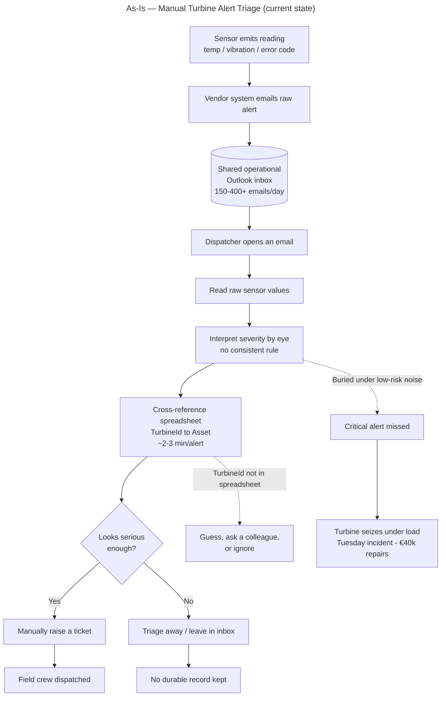
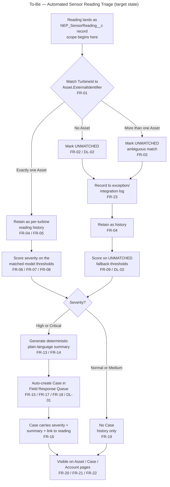
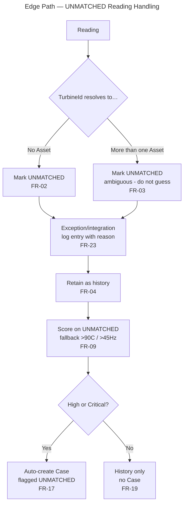
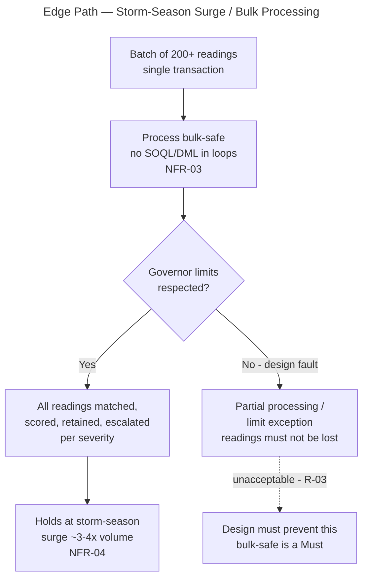
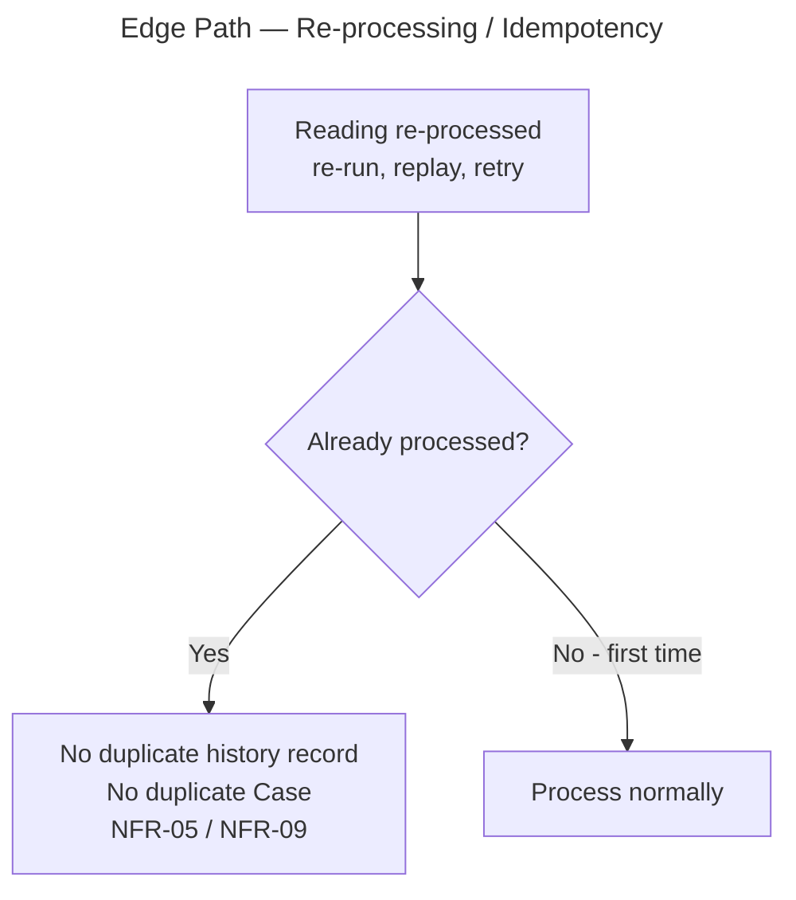
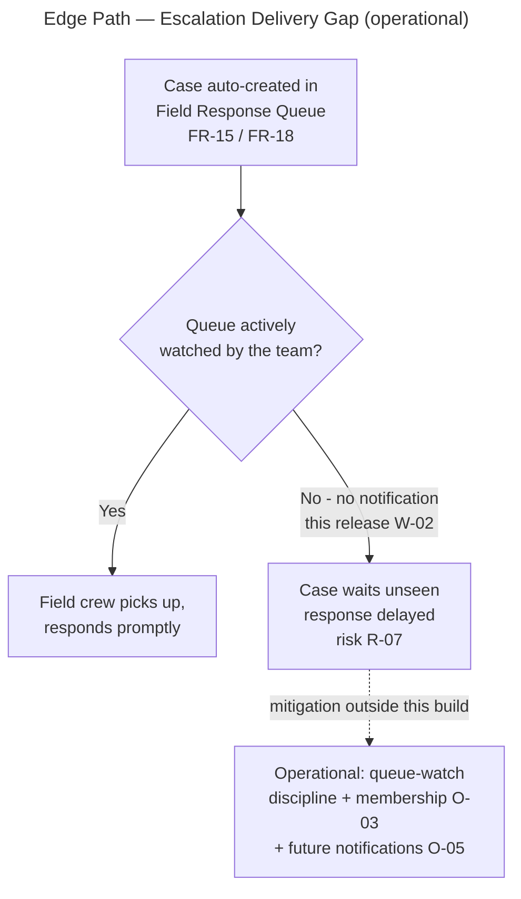
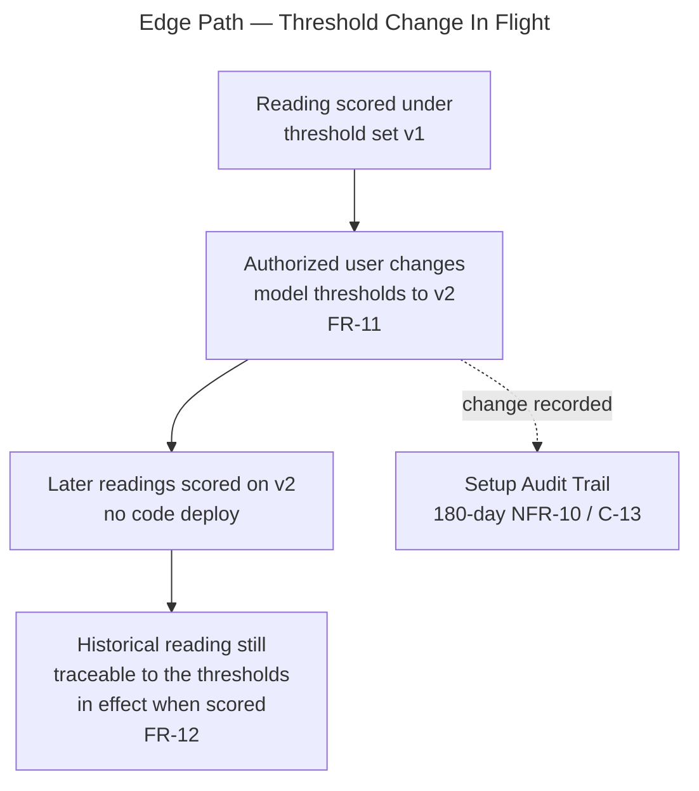

# As-Is vs To-Be Process Analysis + Exception/Edge Paths — NEP Turbine Sensor Alert Triage

**Project:** Nordic EcoPower SEAP — Turbine Sensor Alert Triage
**Client:** Nordic EcoPower (NEP)
**Platform:** Salesforce Service Cloud (NEP's existing org)
**Phase:** Discovery / Align (process analysis — solution-level, not build-ready design)
**Prepared on:** 2026-10-06
**Status:** Draft for review
**Persona framing:** Solution Architect — every To-Be step traces to a catalogued requirement (FR/NFR) and a committed Intake decision; process is described at the level of *what happens*, not *how it is wired*.

---

## 0. How to read this document

- The **As-Is** describes NEP's current manual triage, drawn from the Intake Summary §1 and the committed Discovery grounding — not invented.
- The **To-Be** describes the automated process once this capability is live. Every To-Be step carries a trace to the requirement it satisfies (**FR-nn / NFR-nn** from `05_FR_NFR_Requirements_Catalogue.md`) and the committed decision behind it (**DL-01 / DL-02**).
- The scope boundary is unchanged: the To-Be process begins **once a reading is already a `NEP_SensorReading__c` record** (A-03 / Assumptions §3). Everything upstream — the vendor system, the Outlook inbox, the integration layer — is As-Is context only and is explicitly out of scope (W-01).
- All diagrams are Mermaid. The **exception and edge paths are first-class**, not an afterthought — the UNMATCHED path, the ambiguous-match path, the surge path, the re-processing path, and the "escalation that nobody watches" gap are each drawn and analysed, because in this project the edge paths are where the business value and the residual risk both live.
- No business or target metrics are invented. Where the As-Is cites a figure (150–400+ emails/day, ~2–3 min/alert, €40k, 3–4× surge), it is quoted from the customer's own documents (A-07); any committed numeric target remains `[TBD]`.

---

## 1. As-Is Process — Manual Email Triage

### 1.1 Narrative

Retrofitted IoT sensors stream temperature, vibration and error-code readings. The vendor's system emails raw, unformatted alerts into a **shared operational Outlook inbox** at **150–400+ emails/day** (Discovery Transcript, via Intake Summary §1). From there the process is entirely human:

1. A dispatcher opens an email and reads raw sensor values.
2. The dispatcher **interprets severity by eye** — there is no consistent rule applied; judgment varies by person, workload and time of day.
3. The dispatcher **cross-references a spreadsheet** to translate the vendor's `TurbineId` into the internal Salesforce Asset.
4. If the reading looks serious enough, the dispatcher **manually raises a ticket**; otherwise the email is triaged away.
5. Nothing durable is retained per turbine — there is **no reliable per-turbine reading history**, so after an incident NEP cannot answer *"did we see this coming?"*.

Each alert takes roughly **2–3 minutes** to triage (Discovery Transcript). At 150–400+/day this is a continuous, high-noise workload.

### 1.2 As-Is process map

### 1.3 Where the As-Is fails (pain points)

| # | Pain point | Business consequence | As-Is evidence |
|---|---|---|---|
| P-1 | **Severity judged by eye, inconsistently** | Same reading triaged differently by different people / at different times | Intake Summary §1 |
| P-2 | **High noise-to-signal ratio** | Critical alert buried under dozens of low-risk warnings → missed | Intake Summary §1 ("Tuesday incident") |
| P-3 | **Manual TurbineId→Asset lookup via spreadsheet** | ~2–3 min/alert; error-prone; breaks when the spreadsheet is stale | Discovery Transcript |
| P-4 | **Ticket raised only if a human decides to** | No guaranteed escalation; depends on attentiveness | Intake Summary §1 |
| P-5 | **No per-turbine reading history** | Cannot answer "did we see this coming?" after an incident | C-Suite Brief; Intake Summary §1 |
| P-6 | **Dispatcher burnout** | Retention and quality risk; worsens under storm surge | C-Suite Brief; Discovery Transcript |
| P-7 | **Breaks down exactly when it matters most** | Storm season raises volume 3–4× *and* turbine stress at the same time | Assumptions & Constraints v5 §1 |

---

## 2. To-Be Process — Automated Triage, Scoring & Escalation

### 2.1 Narrative

The upstream path (sensor → vendor → integration) is unchanged and out of scope. The To-Be process begins the instant a reading becomes a **`NEP_SensorReading__c`** record and runs **without a human in the critical path**:

1. **Match** the reading to its turbine Asset on `TurbineId` → `Asset.ExternalIdentifier` *(FR-01)*. If it matches nothing — or matches more than one — it takes the **UNMATCHED path** *(FR-02, FR-03; DL-02)*.
2. **Retain** the reading as per-turbine history regardless of severity *(FR-04, FR-05)*.
3. **Score** severity automatically against the matched model's thresholds — or the UNMATCHED fallback thresholds *(FR-06, FR-07, FR-08, FR-09; DL-02)*.
4. For **High/Critical**, generate a **deterministic plain-language summary** — never generative AI *(FR-13, FR-14; NFR-02)*.
5. **Escalate** High/Critical readings by auto-creating a **Case in the Field Response Queue**, carrying severity, summary and a link back to the reading *(FR-15, FR-16, FR-17, FR-18; DL-01)*.
6. **Suppress** escalation for Normal/Medium — retained as history only, no Case *(FR-19)*.
7. Make the new information **visible on existing pages** — Asset, Case, Account *(FR-20, FR-21, FR-22)*.
8. **Log** unmatched and exception conditions for follow-up *(FR-23)*.

The whole path is **deterministic, bulk-safe and idempotent** *(NFR-01, NFR-03, NFR-05)* so it holds up under storm-season surge *(NFR-04)* and never double-escalates on re-processing.

### 2.2 To-Be process map (happy path + principal forks)

### 2.3 To-Be step → requirement trace

| To-Be step | Satisfies | Committed decision |
|---|---|---|
| Match reading to Asset | FR-01 | — |
| Unmatched / ambiguous → UNMATCHED path, logged | FR-02, FR-03, FR-23 | DL-02 |
| Retain every reading as history | FR-04, FR-05 | — |
| Score on matched-model thresholds | FR-06, FR-07, FR-08 | — |
| Score UNMATCHED on fallback thresholds | FR-09 | DL-02 |
| Plain-language summary (deterministic) | FR-13, FR-14 | — (NFR-02) |
| Auto-escalate High **and** Critical | FR-15, FR-17 | DL-01 |
| Case carries severity/summary/link, lands in Field Response Queue | FR-16, FR-18 | — |
| Suppress Normal/Medium | FR-19 | — |
| Surface on Asset / Case / Account pages | FR-20, FR-21, FR-22 | — |

---

## 3. Exception & Edge Paths (first-class)

The happy path is the smaller part of the value here. These are the paths that caused the As-Is to fail, and the ones a reviewer must be able to see explicitly.

### 3.1 UNMATCHED path (no Asset / ambiguous Asset)

**Rule (DL-02, FR-02/FR-03/FR-09/FR-17):** a reading that matches no Asset — or matches more than one — is never dropped. It is marked UNMATCHED, logged, retained, scored on the fallback thresholds (> 90 °C / > 45 Hz), and **still escalates** if it scores High/Critical.

**Why it matters:** this is the direct countermeasure to As-Is pain **P-2/P-4** — a dangerous reading from an unknown turbine can no longer vanish because a dispatcher didn't recognise the ID. **Residual risk R-04** (mass-UNMATCHED) applies if the Asset-population integration (A-02) is not ready at go-live: matching would have nothing to match against and the fallback path would fire fleet-wide. That is an operational prerequisite to confirm, not a defect in this process.

### 3.2 Surge / bulk path (storm season)

**Rule (NFR-03, NFR-04):** readings arrive in batches of 200+ in a single transaction and must all be matched, scored, retained and escalated without SOQL/DML in loops and without breaching governor limits — correctly, at ~3–4× normal volume.

**Why it matters:** the As-Is **breaks down precisely under surge** (P-7). Bulk-safety is therefore not a nice-to-have — it is the condition under which the whole business case holds. Note the committed sustained-throughput/processing-time target is **`[TBD]`** (NFR-04) and must be validated under surge-equivalent load before go-live; no number is invented here.

### 3.3 Re-processing / idempotency path

**Rule (NFR-05):** the same reading processed twice must not create a duplicate history record or a duplicate escalation Case.

**Why it matters:** external feeds and retries make replay inevitable. Without idempotency the Field Response Queue would fill with duplicate Cases during a surge — reintroducing the noise problem (P-2) the project exists to remove. Supported by the external-ID / safe-upsert requirement (NFR-09).

### 3.4 "Escalation nobody watches" gap (process risk, not a build defect)

**Context (W-02, risk R-07):** notifications (email/in-app) to the response team are **out of scope** this release. Escalation lands a Case in the Field Response Queue — but the queue being *watched* is an operational behaviour, not something this build enforces.

**Why it matters:** this is the one place the To-Be process is **not fully self-closing**. The automation guarantees a Case *exists* promptly (FR-15, NFR-07) but not that a human *sees* it, because notifications and queue membership (O-03) are deferred. This is called out so NEP owns the operational mitigation (queue-watch discipline now; notifications as a candidate for the next release, O-05) rather than discovering the gap during a storm.

### 3.5 Threshold-change-in-flight edge

**Context (FR-11, FR-12):** authorized staff can revise a model's thresholds without a rebuild, and it must remain possible to tell which thresholds judged a historical reading.

**Why it matters:** a threshold change must not retroactively obscure how an old reading was judged (the "did we see this coming?" question depends on it). Whether FR-12 is met by capturing applied-threshold context on the reading itself or by relying on the audit trail is a **Design-and-Model decision (O-04)** — stated here as an outcome, not a mechanism.

---

## 4. As-Is → To-Be, Pain Point by Pain Point

| As-Is pain | To-Be countermeasure | Requirement |
|---|---|---|
| P-1 Severity by eye, inconsistent | Automatic, rule-based scoring on every reading | FR-06, FR-07, NFR-01 |
| P-2 Critical buried under noise | High/Critical always escalate; Normal/Medium suppressed | FR-15, FR-19 |
| P-3 Manual TurbineId→Asset lookup | Automatic match to Asset; unmatched handled explicitly | FR-01, FR-02, FR-03 |
| P-4 Ticket only if a human decides | Guaranteed automatic Case creation, no manual safeguard | FR-15, FR-17, DL-01 |
| P-5 No per-turbine history | Every reading retained and viewable in turbine context | FR-04, FR-05 |
| P-6 Dispatcher burnout | Human removed from the triage critical path | whole To-Be flow |
| P-7 Breaks under surge | Bulk-safe, idempotent, surge-tolerant processing | NFR-03, NFR-04, NFR-05 |

**Residual (not closed by this release):** P-4 is closed for *Case creation* but the *delivery* of that signal to a human depends on queue-watching (§3.4, R-07), since notifications are out of scope (W-02).

---

## 5. Volumetrics (as-captured, not invented)

Carried from the customer's own documents; used to size the surge path, not as committed targets.

| Measure | Value | Source | Status |
|---|---|---|---|
| Inbound alert volume (normal) | 150–400+ emails/day | Discovery Transcript | Customer-stated |
| Manual triage effort | ~2–3 min/alert | Discovery Transcript | Customer-stated |
| Storm-season multiplier | ~3–4× volume | Assumptions & Constraints v5 §1 | Customer-stated |
| Bulk-processing design target | 200+ records / transaction | Guidelines §1 (C-3) | Platform/design constraint |
| Committed sustained throughput / processing-time | `[TBD]` | — | To validate under surge load (NFR-04) |
| Committed escalation response-time | `[TBD]` | O-02 | Owner: Lars Knudsen + delivery lead |

---

## 6. Open Items Bearing on the Process

| Open item | Where it bites in the process | Owner | Status |
|---|---|---|---|
| **A-02 / R-04** — Asset-population integration ready at go-live | §3.1 — if not ready, UNMATCHED path fires fleet-wide | Asset-population integration owner [TBD] | To confirm with NEP |
| **O-02** — committed escalation response-time | §3.4 / NFR-07 — defines "promptly" | Lars Knudsen (VP Ops) + delivery lead | `[TBD]` |
| **O-03** — Field Response Queue membership | §3.4 — who actually works the escalations | NEP Operations | Deferred |
| **W-02 / R-07** — no notifications this release | §3.4 — escalation delivery gap | NEP Operations (watch discipline); O-05 (future) | Operational mitigation |
| **O-04** — threshold-version traceability mechanism | §3.5 / FR-12 | SF Architect | Design conversation |

---

### Sources
- 01_Intake_Summary_Project_Brief.md (Artifact)
- 02_Decision_and_Assumptions_Log.md (Artifact)
- 04_Initial_Risk_and_Dependency_Register.md (Artifact)
- 05_FR_NFR_Requirements_Catalogue.md (Artifact)
