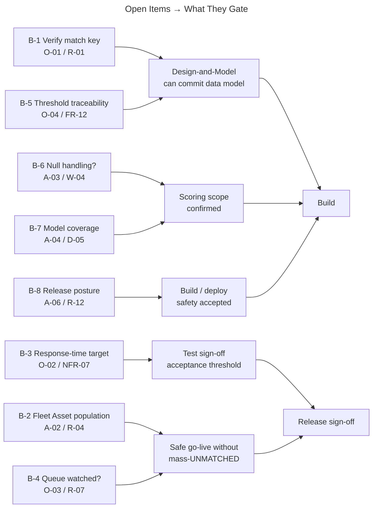

# Open-Items Resolution Brief — NEP Turbine Sensor Alert Triage

**Project:** Nordic EcoPower SEAP — Turbine Sensor Alert Triage
**Client:** Nordic EcoPower (NEP)
**Platform:** Salesforce Service Cloud (NEP's existing org)
**Phase:** Discovery / Align (decision-forcing brief — solution-level, not build-ready design)
**Prepared on:** 2026-10-06
**Status:** Draft for review
**Persona framing:** Solution Architect — each open item framed by the business decision it forces, the design it gates, a recommendation to accept or amend, and an owner. Mechanism named only where a committed decision already fixed it.

---

## 0. Purpose

The requirements catalogue (`05`) and the process analysis (`06`) are complete and internally consistent. What remains before Design-and-Model can commit the data model is a small set of **open items that only NEP (or a named owner) can close** — plus a short list of assumptions this phase proceeded on that warrant a confirm-or-correct. This brief exists to force those decisions *now*, while they are cheap, rather than during the storm-season crunch when they are not.

Nothing here re-opens a committed decision (DL-01…DL-05). Each item below is either an **open item (O-nn)** carried from Intake, an **assumption (A-nn)** proceeding silently that should be confirmed, or a **risk (R-nn)** whose closure depends on one of them.

**The single most important sentence in this document:** whether the UNMATCHED path (§3.1 of the process analysis) is a rare edge case or the fleet's *default behaviour at go-live* is decided entirely by **O-01 + A-02** below. Everything else is tuning; those two are the value case.

---

## 1. Decision Summary (read this first)

| # | Open item | Decision NEP must make | What it gates | Recommendation | Owner | Target date |
|---|---|---|---|---|---|---|
| B-1 | **O-01 / R-01** — is `Asset.ExternalIdentifier` present and does it hold the matching turbine Id? | Confirm the field is the match key, or name the field that is. | FR-01, FR-08 — the entire matching mechanism; **design gate** | **Confirm now.** Field verified *present* on the connected org this stage; confirm it is the intended match key before the data model is committed. | SF Architect + NEP Admin | Before Design starts |
| B-2 | **A-02 / R-04 / D-02** — will `ExternalIdentifier` + `Model` be populated across the fleet by go-live? | Confirm the Asset-population integration is ready, or set a fallback plan. | FR-01, FR-02 — decides whether UNMATCHED is edge-case or fleet-wide | **Confirm readiness + owner.** This is the highest-leverage open item. If not ready, mass-UNMATCHED (R-04) is the go-live reality. | NEP Operations + Asset-population integration owner **[TBD]** | Before go-live; readiness view before Design |
| B-3 | **O-02 / NFR-07** — what is the committed escalation response-time target? | Set a number (or accept "promptly, no manual delay" qualitatively for release 1). | NFR-07 — the acceptance threshold for "prompt" escalation | **Accept qualitative for R1; defer the number.** "Within minutes" is directional; a committed figure needs Ops sign-off. Keep `[TBD]`. | Lars Knudsen (VP Ops) + delivery lead | Before test sign-off |
| B-4 | **O-03 / D-04 / R-07** — who watches the Field Response Queue, and is a notification needed in R1? | Confirm queue membership + accept that R1 has no notifications (W-02). | FR-18 operational meaning; closes R-07 operationally | **Confirm membership + watch discipline now; keep notifications out of R1.** Escalation creates a Case promptly but does not alert a human. | NEP Operations | Before go-live |
| B-5 | **O-04 / R-08 / FR-12** — how is "which thresholds judged this reading" satisfied? | Choose: capture applied-threshold context on the reading, or rely on Setup Audit Trail. | FR-12, NFR-10 — threshold-version traceability | **Decide in Design (timeboxed).** Recommend capturing context on the reading record; must not block build. | SF Architect | Early Design (timeboxed) |
| B-6 | **A-03 / W-04** — do production payloads ever have null/missing fields? | Confirm payloads are always complete, or add null-handling to scope. | Scoring robustness; currently assumed complete | **Confirm.** If production data has gaps, null-handling (W-04) must come into scope — it is currently excluded. | NEP + integration owner | Before Design |
| B-7 | **A-04 / D-05** — do the three named models + UNMATCHED cover the whole fleet? | Confirm model coverage against the real fleet list. | FR-08 — correct per-model scoring | **Confirm coverage.** Any additional fleet model needs its own threshold row, else it silently falls to UNMATCHED fallback. | VP Ops + Maintenance Engineers | Before Design |
| B-8 | **A-06 / R-12 / D-06** — is the SEAP-provisioned org the production-equivalent target, with no CI/CD or sandbox net? | Confirm the release posture, or raise an environment strategy. | Build/deploy safety | **Confirm the accepted posture.** A mistake lands directly; mitigated by check-only validation + review before deploy. | NEP Admin + delivery | Before Build |

---

## 2. The Two That Decide the Value Case

### B-1 — Verify the match key (O-01 / R-01) — *design gate*

**The decision:** Confirm `Asset.ExternalIdentifier` is the field the inbound `TurbineId` matches against — or name the field that is.

**Why it is a gate, not a preference.** FR-01 (match every reading), FR-08 (score on the matched model's thresholds), FR-04/FR-05 (per-turbine history) and the entire escalation chain all hang off a single join: `NEP_SensorReading__c.TurbineId` → `Asset.ExternalIdentifier`. If that field is not the match key, the matching design changes materially and so does the data model Design-and-Model is about to commit.

**Current status.** The field has been **confirmed present on the connected org** at this stage (this closed the field-level part of R-01). What remains is a business confirmation that it is the *intended* match key and that its values are the vendor's `TurbineId`, not some other identifier scheme.

**Recommendation:** Confirm now, before the data model is committed. This is a 10-minute conversation that de-risks the whole build. *Proceeding assumption if silent (A-01): `ExternalIdentifier` is the unique, correct match key.*

### B-2 — Fleet-wide Asset population readiness (A-02 / R-04 / D-02) — *highest leverage*

**The decision:** Confirm the integration that populates `Asset.ExternalIdentifier` and `Asset.Model` across the fleet will be ready at go-live — and name its owner.

**Why this is the one that matters most.** The matching mechanism can be perfectly built and still produce the wrong outcome if the Assets it matches against have no `ExternalIdentifier`/`Model` populated. In that case **every reading defaults to UNMATCHED** (R-04) and the fleet runs on fallback thresholds (> 90 °C / > 45 Hz) — a far blunter instrument than the per-model thresholds the business case depends on. DL-02 ensures those readings still *score and escalate*, so nothing is silently lost — but mass-UNMATCHED is a quality failure, not a safe fallback.

**This is a boundary risk, not a build risk.** The build is well-specified; the exposure lives at the data-readiness boundary. Design-and-Model cannot close it — only NEP and the integration owner can.

**Recommendation:** Get a readiness view **before Design** and a named owner for D-02 (currently **[TBD]**). If readiness is uncertain, make a conscious call: accept a phased go-live (populate Assets first), or accept fleet-wide fallback scoring for an initial window with eyes open. Either is defensible; drifting into it unknowingly is not.

---

## 3. The Rest — Confirm or Accept

### B-3 — Escalation response-time target (O-02 / NFR-07)
"Within minutes, ideally" is directional (A-07 — customer-stated, not committed). NFR-07 states the requirement qualitatively ("promptly, no manual delay") and holds the number at `[TBD]`. **Recommendation:** accept the qualitative requirement for release 1 and defer the committed number to test sign-off, owned by Lars Knudsen + delivery lead. No number is invented.

### B-4 — Field Response Queue: watched by whom? (O-03 / D-04 / R-07)
Escalation lands a Case in the Field Response Queue (FR-18) — but notifications are out of scope (W-02), so the queue being *watched* is an operational behaviour this build does not enforce. This is the one place the To-Be process is **not self-closing** (process analysis §3.4). **Recommendation:** confirm queue membership and queue-watch discipline before go-live; keep notifications out of R1 and record them as the leading R2 candidate (O-05). NEP owns the operational mitigation — flag it now so it is not discovered during a storm.

### B-5 — Threshold-version traceability (O-04 / R-08 / FR-12)
FR-12 requires that one can tell which thresholds judged a historical reading. Two mechanisms are candidates: capture applied-threshold context *on the reading record* at scoring time, or rely on the 180-day Setup Audit Trail (NFR-10 / C-13). **Recommendation:** decide early in Design (timeboxed so it cannot block build); the stronger option is capturing context on the reading, because the "did we see this coming?" question (P-5) is answered from the reading, not from Setup. Stated as outcome; mechanism is a Design decision.

### B-6 — Null / missing-field handling (A-03 / W-04)
Scoring currently assumes every payload is complete (A-03); null-handling is explicitly out of scope (W-04). If production vendor data ever has gaps, scoring would break on those readings. **Recommendation:** confirm with NEP + the integration owner whether completeness holds for *production* data (not just the sample set). If it does not, W-04 must be pulled into scope — surface it before Design rather than discovering it in test.

### B-7 — Fleet model coverage (A-04 / D-05)
Scoring uses per-model thresholds for NEP-Legacy / NEP-Standard / NEP-NextGen plus UNMATCHED fallback. If the real fleet contains other models, their readings silently fall to fallback thresholds. **Recommendation:** confirm the three named models + UNMATCHED cover the actual fleet; any additional model needs its own threshold row. A quick fleet-list check with Maintenance Engineers closes this.

### B-8 — Release posture / environment (A-06 / R-12 / D-06)
The SEAP-provisioned org is assumed to be the production-equivalent target with no CI/CD or sandbox safety net (A-06); a mistake lands directly (R-12). **Recommendation:** confirm this posture is accepted, mitigated by the SEAP build platform's check-only validation and review-before-deploy. If NEP expects a managed release path, raise it now — it changes nothing in requirements but much in delivery.

---

## 4. What Closing These Unblocks

**Before Design starts:** B-1, B-2 (readiness view), B-6, B-7.
**Before Build:** B-5 (early-Design decision), B-8.
**Before go-live / sign-off:** B-2 (final), B-3, B-4.

---

## 5. Items Deliberately Left Open (not errors)

So no later reader mistakes a deferral for an oversight:

- **O-05** — reporting/dashboards (Lars's operational health view; executive before/after view). Known future desire, explicitly out of release 1 (W-03). Recorded, not resolved.
- **W-01** — vendor→Salesforce integration layer. Out of scope; the To-Be begins at `NEP_SensorReading__c`.
- **W-02** — notifications. Out of R1 by decision; the leading R2 candidate (see B-4).

---

### Sources
- 01_Intake_Summary_Project_Brief.md (Artifact)
- 02_Decision_and_Assumptions_Log.md (Artifact)
- 04_Initial_Risk_and_Dependency_Register.md (Artifact)
- 05_FR_NFR_Requirements_Catalogue.md (Artifact)
- 06_As-Is_vs_To-Be_Process_Analysis.md (Artifact)
