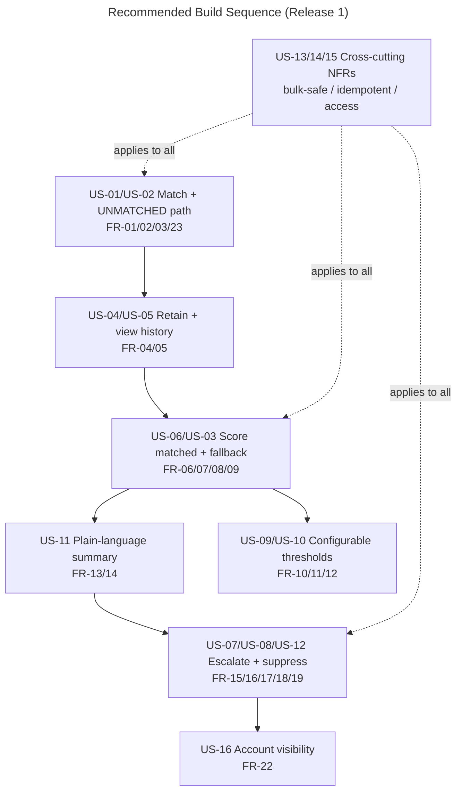

# Prioritised User-Story Seed / Backlog — NEP Turbine Sensor Alert Triage

**Project:** Nordic EcoPower SEAP — Turbine Sensor Alert Triage
**Client:** Nordic EcoPower (NEP)
**Platform:** Salesforce Service Cloud (NEP's existing org)
**Phase:** Discovery / Align (user-story seed — solution-level, not build-ready design)
**Prepared on:** 2026-10-06
**Status:** Draft for review
**Persona framing:** Solution Architect — every story traces to a catalogued requirement (FR/NFR) and carries outcome-asserting acceptance criteria in Gherkin. Stories say *what must be true for whom and why*, not *how to build it*.

---

## 0. How to read this document

- Each story carries: an **ID** (US-nn), the **role / want / so-that** form, the **requirements it realises** (FR/NFR from `05`), its **MoSCoW priority**, a **release** (R1 / R2-candidate), and **acceptance criteria** (Gherkin, outcome-asserting per NFR-13 / C-11).
- Stories are a **re-slice of the catalogue for delivery**, not new requirements. Every acceptance criterion traces back to a catalogued FR/NFR; where a story's full acceptance detail already lives in catalogue `05`, this document references it rather than duplicating it.
- Priority and release follow the catalogue's MoSCoW and the committed scope boundary. "Won't (this release)" items from `05` §4 are shown as **R2-candidates** at the end so the backlog is complete, not truncated.
- The scope boundary is unchanged: stories begin **once a reading is a `NEP_SensorReading__c` record** (A-03). The vendor/integration layer (W-01) produces no stories in this release.
- **No business/target metrics are invented** (A-07). Where a volume or multiplier appears it is customer-stated; committed numeric targets remain `[TBD]`.
- Stories gated by an open item carry a **⚠ gate** note pointing to the resolution brief (`07`).

---

## 1. Personas (who these stories serve)

| Persona | Role in this capability | Primary stories |
|---|---|---|
| **Dispatcher / Operations controller** | Today triages the Outlook inbox by eye; in the To-Be is removed from the critical path and consumes escalations from the queue. | US-07, US-08, US-11 |
| **Field Response crew** | Picks up escalated Cases from the Field Response Queue and acts. | US-07, US-08, US-11 |
| **Maintenance Engineer** | Reviews per-turbine reading history; owns threshold values per model. | US-04, US-05, US-09, US-10 |
| **System Administrator** | Owns configuration, thresholds, access, and the org. | US-09, US-10, US-13, US-15 |
| **VP Operations (Lars Knudsen)** | Accountable for operational reliability; owns the response-time target and the business case. | US-07 (outcome), US-05 (history/"did we see this coming?") |
| **Salesforce Architect / Build** | Delivers deterministically, bulk-safe, declaratively-first, idempotent. | US-12, US-13, US-14, US-15, US-16 |

---

## 2. Release-1 Backlog — Prioritised

### Epic A — Match the reading to its turbine

#### US-01 — Match a reading to its turbine Asset  ·  **Must**  ·  R1
*As the* Operations team, *I want* every inbound reading matched to its physical turbine Asset *so that* severity is judged against the right turbine and history accrues to the right machine.
**Realises:** FR-01. **Depends on:** `Asset.ExternalIdentifier` as match key.
**⚠ Gate:** B-1 / B-2 in `07` — match key confirmed (B-1) and fleet Asset population ready (B-2); if B-2 is not ready, most readings take the UNMATCHED path (US-02).
```gherkin
Scenario: Reading matches a known turbine
  Given a sensor reading with a TurbineId that corresponds to exactly one turbine Asset
  When the reading is processed
  Then the reading is linked to that turbine Asset
  And the reading is not marked UNMATCHED
```

#### US-02 — Never lose an unmatched or ambiguous reading  ·  **Must**  ·  R1
*As the* Operations team, *I want* a reading that matches no turbine (or more than one) retained, marked UNMATCHED and logged *so that* a dangerous reading from an unknown turbine can never silently vanish — the exact As-Is failure (P-2/P-4).
**Realises:** FR-02, FR-03, FR-23. **Decision:** DL-02.
```gherkin
Scenario: Reading does not match any turbine
  Given a sensor reading with a TurbineId that matches no turbine Asset
  When the reading is processed
  Then the reading is retained and marked UNMATCHED
  And an exception/integration log entry is recorded with the reason
  And the reading is not deleted or silently discarded

Scenario: TurbineId resolves to more than one Asset
  Given a sensor reading whose TurbineId matches more than one turbine Asset
  When the reading is processed
  Then the reading is marked UNMATCHED noting the ambiguous match
  And the reading is not linked to any single Asset by guesswork
```

### Epic B — Retain per-turbine history

#### US-04 — Retain every reading as per-turbine history  ·  **Must**  ·  R1
*As a* Maintenance Engineer, *I want* every reading retained as chronological per-turbine history — critical or not *so that* after an incident we can answer "did we see this coming?" (closes P-5).
**Realises:** FR-04.
```gherkin
Scenario: A non-critical reading is still retained
  Given a sensor reading that scores Normal
  When the reading is processed
  Then the reading is retained as part of the turbine's reading history
  And it is retained whether or not it triggered an escalation
```

#### US-05 — View a turbine's reading history in context  ·  **Must**  ·  R1
*As a* Maintenance Engineer, *I want* a turbine's reading history visible from the turbine itself, chronologically *so that* I can review a machine's trend without hunting across records.
**Realises:** FR-05, FR-20 (Asset-page visibility).
```gherkin
Scenario: Viewing a turbine's reading history
  Given a turbine Asset with multiple retained readings over time
  When a user opens that Asset's record page
  Then the readings are visible in chronological order
  And each entry shows at least error code, temperature, vibration and timestamp
```

### Epic C — Score severity automatically

#### US-06 — Score every reading automatically on the right model's thresholds  ·  **Must**  ·  R1
*As the* Operations team, *I want* every reading scored automatically against the matched turbine model's thresholds using the documented hierarchy *so that* severity is consistent and no longer judged by eye (closes P-1).
**Realises:** FR-06, FR-07, FR-08, NFR-01. **Full scoring-matrix acceptance:** see `05` FR-07 / FR-08 (Scenario Outlines retained there; not duplicated).
```gherkin
Scenario: The same raw values score differently across models
  Given two readings each with temperature 88 C and vibration 48 Hz
  And the first is matched to an NEP-Legacy turbine (> 90 C / > 45 Hz)
  And the second to an NEP-Standard turbine (> 80 C / > 50 Hz)
  When both are scored
  Then the NEP-Legacy reading is scored High and the NEP-Standard reading is scored Medium
```

#### US-03 — Score unmatched readings on fallback thresholds  ·  **Must**  ·  R1
*As the* Operations team, *I want* an UNMATCHED reading still scored on the fallback thresholds (> 90 °C / > 45 Hz) *so that* a dangerous reading from an unknown turbine is not left unscored.
**Realises:** FR-09. **Decision:** DL-02.
```gherkin
Scenario: An unmatched reading is still scored on fallback thresholds
  Given a reading marked UNMATCHED with temperature 95 C and vibration 48 Hz
  When the reading is scored
  Then the UNMATCHED fallback thresholds (> 90 C / > 45 Hz) are applied
  And the reading is scored Critical
```

### Epic D — Explain and escalate

#### US-11 — Plain-language summary for High/Critical readings  ·  **Must**  ·  R1
*As a* Dispatcher / field crew member, *I want* every High/Critical reading to carry a short, non-technical explanation of why it was flagged *so that* I can act without interpreting raw sensor values.
**Realises:** FR-13, FR-14, NFR-01, NFR-02. **Hard constraint:** deterministic string logic, no generative AI.
```gherkin
Scenario: A Critical reading carries a deterministic plain-language summary
  Given a reading scored Critical because temperature and vibration are both elevated
  When the reading is processed
  Then a short plain-language summary describing the condition is produced
  And the summary is readable without interpreting raw numeric values
  And generating the summary twice for the same reading yields identical text
  And no step depends on a generative-AI service
```

#### US-07 — Automatically escalate High and Critical readings  ·  **Must**  ·  R1
*As* VP Operations, *I want* every High **and** Critical reading to automatically create a Case in the Field Response Queue with no manual step *so that* a critical alert can never be missed because a human didn't act (closes P-2/P-4).
**Realises:** FR-15, FR-17, FR-18. **Decision:** DL-01. **⚠ Gate:** B-4 in `07` — the queue must be watched (notifications are out of R1, W-02).
```gherkin
Scenario Outline: High and Critical both escalate automatically
  Given a reading scored "<severity>"
  When the reading is processed
  Then a Case is automatically created in the Field Response Queue
  And no manual action was required
  Examples: | severity | High | Critical |

Scenario: An unmatched Critical reading still escalates
  Given a reading marked UNMATCHED scored Critical on fallback thresholds
  When the reading is processed
  Then a Case is created in the Field Response Queue
  And the escalation is identifiable as relating to an UNMATCHED reading
```

#### US-08 — Escalated Case is actionable on its own  ·  **Must**  ·  R1
*As a* Field Response crew member, *I want* the escalation Case to show severity, the plain-language summary, and a link back to the reading *so that* I have full context without hunting for it.
**Realises:** FR-16, FR-21 (Case-page visibility).
```gherkin
Scenario: The escalation Case is actionable on its own
  Given a High or Critical reading has escalated
  When the resulting Case is opened
  Then the Case shows the severity, the plain-language summary, and a link to the originating reading
```

#### US-12 — Suppress escalation for Normal/Medium  ·  **Must**  ·  R1
*As the* Operations team, *I want* Normal and Medium readings to create no Case — retained as history only *so that* the Field Response Queue carries signal, not noise (the As-Is problem reversed).
**Realises:** FR-19.
```gherkin
Scenario Outline: Normal and Medium readings do not escalate
  Given a reading scored "<severity>"
  When the reading is processed
  Then no Case is created
  And the reading is retained as history only
  Examples: | severity | Normal | Medium |
```

### Epic E — Configure thresholds without a rebuild

#### US-09 — Thresholds are configuration, revisable without a deploy  ·  **Must**  ·  R1
*As a* System Administrator / Maintenance Engineer, *I want* model thresholds held as configuration I can revise *so that* I can tune sensitivity without a code deployment.
**Realises:** FR-10, FR-11, NFR-06.
```gherkin
Scenario: A threshold change takes effect on later readings without a deploy
  Given an authorized user changes the NEP-Standard temperature threshold from 80 C to 78 C
  When a new NEP-Standard reading with temperature 79 C is processed afterward
  Then that reading is scored temperature-elevated against the new 78 C threshold
  And no code deployment was required
```

#### US-10 — Know which thresholds judged a historical reading  ·  **Should**  ·  R1
*As a* Maintenance Engineer, *I want* to tell which threshold criteria were in effect when an old reading was scored *so that* a later threshold change does not retroactively obscure how it was judged.
**Realises:** FR-12, NFR-10. **⚠ Gate:** B-5 in `07` — mechanism (context-on-reading vs Setup Audit Trail) is an early-Design decision.
```gherkin
Scenario: Determining which thresholds judged a past reading
  Given a reading scored under one set of model thresholds
  And those thresholds are later changed
  When someone reviews that historical reading
  Then they can determine which threshold criteria were in effect when it was scored
```

### Epic F — Make it visible

#### US-16 — Reach a site's turbines from the Account  ·  **Should**  ·  R1
*As a* user, *I want* an Account's turbine Assets reachable from the Account page *so that* I can navigate from customer/site to its machines.
**Realises:** FR-22. *(Asset- and Case-page visibility are covered within US-05 and US-08.)*
```gherkin
Scenario: Turbine Assets reachable from the Account
  Given an Account associated with one or more turbine Assets
  When a user opens that Account's record page
  Then the related turbine Assets are visible from the Account page
```

### Epic G — Quality the capability must hold to (cross-cutting)

These are non-functional stories: they constrain *how* every functional story is delivered. They are "done" when the functional stories pass under these conditions, not as standalone features.

#### US-13 — Bulk-safe, surge-tolerant processing  ·  **Must**  ·  R1
*As the* Operations team, *I want* batches of 200+ readings processed correctly without governor-limit failures, holding under storm-season surge *so that* the automation does not break exactly when it matters most (closes P-7).
**Realises:** NFR-03, NFR-04. **Note:** committed sustained-throughput target is **`[TBD]`** (B-3 context) — validated under surge-equivalent load before go-live; storm multiplier ~3–4× is customer-stated, not a committed target.
```gherkin
Scenario: A batch of readings is processed without limit failures
  Given a batch of 200 or more readings processed in a single transaction
  When the batch is processed
  Then every reading is matched, scored, retained and (where applicable) escalated
  And no Salesforce governor limit is exceeded
```

#### US-14 — Idempotent / re-runnable processing  ·  **Must**  ·  R1
*As the* Operations team, *I want* re-processing the same reading to create no duplicate history or duplicate Case *so that* retries and replays don't re-flood the queue with noise.
**Realises:** NFR-05, NFR-09.
```gherkin
Scenario: Re-processing a reading does not duplicate records
  Given a reading already processed and escalated
  When the same reading is processed again
  Then no duplicate reading-history record is created
  And no duplicate escalation Case is created
```

#### US-15 — Admin access granted at creation (no post-deploy blind spots)  ·  **Must**  ·  R1
*As a* System Administrator, *I want* every new object/field to have Admin object access and FLS at creation/deploy *so that* there is no "field not visible / access denied" state after deploy.
**Realises:** NFR-08. **Also governs delivery:** NFR-11 (declarative-first), NFR-12 (naming), NFR-13 (≥80% coverage, outcome-asserting tests) — delivery constraints applied to every story above.
```gherkin
Scenario: Admin can see new objects and fields immediately on deploy
  Given a new object or field created by this capability
  When the System Administrator views it after deploy
  Then the Admin has object access and field-level security to it
```

---

## 3. Prioritised Order of Build (recommended)

Sequenced by dependency, not just priority — matching comes first because everything downstream reads its result; visibility and the Account related-list come last.



| # | Story | Priority | Why this position |
|---|---|---|---|
| 1 | US-01, US-02 | Must | Match + UNMATCHED path — everything downstream reads the match result; UNMATCHED is first-class, not an afterthought |
| 2 | US-04, US-05 | Must | History must capture from the first reading; retention precedes scoring semantics |
| 3 | US-06, US-03 | Must | Scoring (matched + fallback) is the core value; needs match + model thresholds in place |
| 4 | US-11 | Must | Summary depends on a High/Critical score existing |
| 5 | US-07, US-08, US-12 | Must | Escalation + suppression depend on score + summary |
| 6 | US-09, US-10 | Must / Should | Configurable thresholds parallel to scoring; US-10 gated by B-5 |
| 7 | US-16 | Should | Account visibility — lowest dependency, safe to land last |
| — | US-13, US-14, US-15 | Must | Cross-cutting — delivered *within* every story above, not after |

---

## 4. Release-2 Candidate Backlog (not in R1 — recorded, not dropped)

From catalogue `05` §4. Shown so the backlog is complete and no omission reads as an oversight.

| ID | Candidate story | Source | Note |
|---|---|---|---|
| US-R2-01 | Notify the response team on escalation (email / in-app) | W-02 / R-07 | Leading R2 candidate — closes the "escalation nobody watches" gap (process `06` §3.4) |
| US-R2-02 | Operational health dashboard (VP Ops) + executive before/after view | W-03 / O-05 | Known future desire; explicitly out of R1 |
| US-R2-03 | Null / missing-field handling for incomplete payloads | W-04 / A-03 | Enters R1 only if B-6 reveals production data has gaps |
| US-R2-04 | Vendor→Salesforce integration layer (Connected App, JWT, REST publishing) | W-01 | Out of scope; To-Be begins at `NEP_SensorReading__c` |
| US-R2-05 | Richer audit (custom audit object / Field Audit Trail / Shield) beyond Setup Audit Trail | W-07 | Only if B-5 outcome demands more than the 180-day trail |
| US-R2-06 | Field Response Queue membership definition | W-06 / O-03 | Operational decision, not a build story (B-4) |

---

## 5. Gated Stories — Summary

Stories that cannot be fully accepted until an open item in `07` is closed:

| Story | Gated by | Consequence if unresolved |
|---|---|---|
| US-01 | B-1 (match key), B-2 (fleet population) | Matching may fail or default fleet-wide to UNMATCHED |
| US-07 | B-4 (queue watched) | Case created but no human alerted (W-02) |
| US-10 | B-5 (traceability mechanism) | Threshold-version traceability mechanism undecided |
| US-13 | B-3 context (`[TBD]` throughput target) | "Holds under surge" has no committed numeric bar yet |
| US-06, US-03 | B-6 (null handling), B-7 (model coverage) | Scoring scope/robustness assumptions unconfirmed |

---

### Sources
- 01_Intake_Summary_Project_Brief.md (Artifact)
- 02_Decision_and_Assumptions_Log.md (Artifact)
- 04_Initial_Risk_and_Dependency_Register.md (Artifact)
- 05_FR_NFR_Requirements_Catalogue.md (Artifact)
- 06_As-Is_vs_To-Be_Process_Analysis.md (Artifact)
- 07_Open_Items_Resolution_Brief.md (Artifact)
