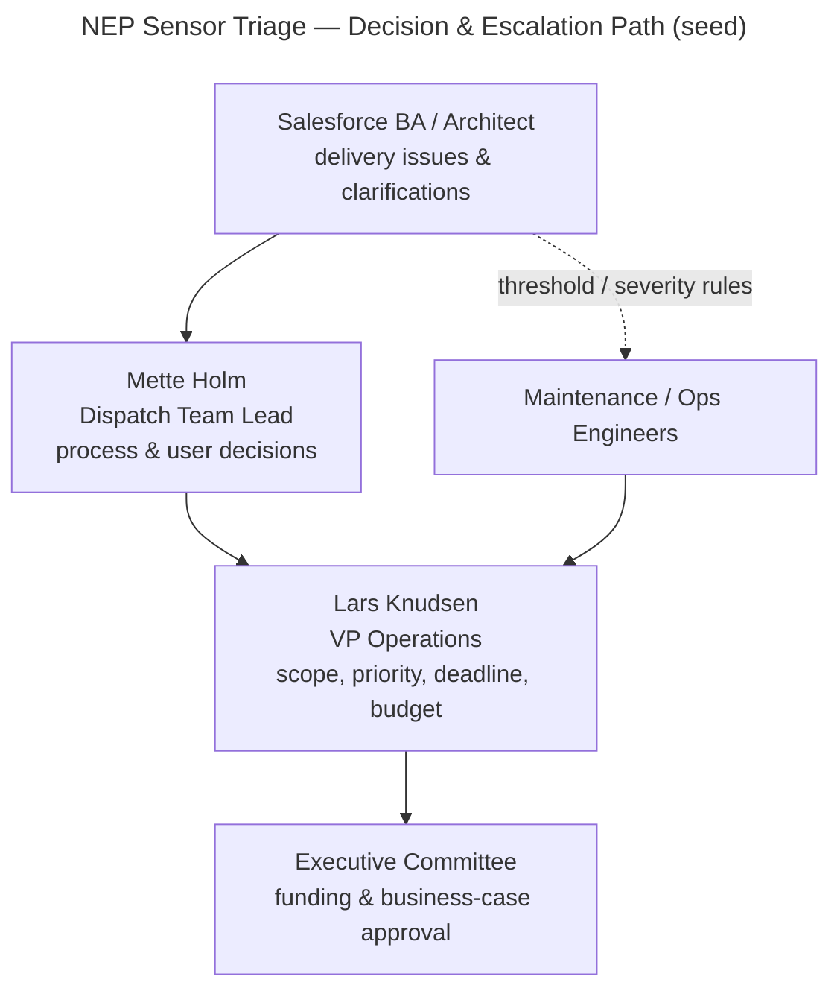

# Stakeholder Map & RACI Seed — NEP Turbine Sensor Alert Triage

**Project:** Nordic EcoPower SEAP — Turbine Sensor Alert Triage
**Phase:** Intake
**Prepared on:** 2026-10-06
**Status:** Draft for approval

This is a **seed**, not a finalised governance model. Named individuals come from the source documents; roles not named in the documents are marked **[role identified — name TBD]** rather than invented.

---

## 1. Stakeholder Map

| Stakeholder | Named? | Role in this initiative | Interest / stake | Influence |
|---|---|---|---|---|
| **Lars Knudsen — VP Operations** | Yes (Discovery Transcript; "From: VP Operations" on C-Suite Brief) | Executive sponsor and business owner. Wrote the business case; wants operational health visibility and a before/after story for the executive team. | High — owns the outcome, the budget justification, and the storm-season deadline. | High |
| **Mette Holm — Dispatch Team Lead** | Yes (Discovery Transcript) | Primary end-user representative / process SME. Lives the manual triage daily; is the authority on how severity is judged today and what "good" looks like. | High — her team is the one relieved (or not) by the solution. | Medium–High |
| **NEP Dispatch Team** | Group (Background; Discovery) | Day-to-day users whose manual triage this replaces. Not escalation recipients in release 1 (no notifications). | High — adoption and relief depend on them. | Medium |
| **Field Response Team / on-call field crews** | Group (BR §6; Discovery) | Recipients of escalated Cases via the new Field Response Queue. Queue **membership determined later, outside this project**. | High — they act on escalations. | Medium |
| **NEP Maintenance / Operations Engineers** | Role (BR §4; Discovery) | Authorized staff who **review and revise severity thresholds** over time (once or twice a year, or after an incident). | High — own the configurable thresholds post-go-live. | Medium |
| **NEP Executive Committee** | Group (C-Suite Brief — "To:") | Approving body for the business case; audience for before/after impact. | Medium — fund and endorse. | High (approval) |
| **System Administrator (NEP Salesforce Admin)** | Role (Guidelines §5) | Must have FLS/object access to every new object/field at creation/deploy; deploys and demos. | Medium | Medium |
| **Sensor Vendor** | External (Background; Assumptions §3) | Owns the sensor hardware and the system that publishes readings. **Integration layer is out of scope**; readings assumed to land as `NEP_SensorReading__c`. | Low (this project) — dependency, not a participant. | Low |
| **Asset-population integration owner** | Role — **[role identified — name TBD]** (BR §8; Assumptions §4) | Owns the existing integration that masters Assets and populates `Asset.ExternalIdentifier` and `Model`. | Medium — a go-live dependency (A-02). | Low–Medium |
| **Salesforce Architect** | Role (Discovery Transcript — present) | Delivery-side solution owner. | High (delivery) | Medium |
| **Salesforce Business Analyst** | Role (Discovery Transcript — present) | Requirements/analysis owner (this intake). | Medium (delivery) | Medium |

**Reading of influence/interest:** The decision-makers are **Lars Knudsen** (sponsor, deadline, budget) and the **Executive Committee** (approval). The most engaged day-to-day stakeholder is **Mette Holm**. The highest-risk *dependency* owners (sensor vendor; Asset-population integration owner) have low project involvement but gate go-live — worth active management despite low influence.

## 2. Decision-Makers & Approvers

| Decision area | Decision-maker / approver | Source |
|---|---|---|
| Business case approval & funding | NEP Executive Committee | C-Suite Brief |
| Scope, priorities, deadline, trade-offs | Lars Knudsen (VP Operations) | C-Suite Brief; Discovery |
| What "elevated"/severity means operationally; threshold values | Lars Knudsen + Maintenance/Ops Engineers | Discovery; BR §4 |
| Field Response Queue membership (later, out of scope here) | NEP Operations | BR §6 |
| Build conformance to design guidelines | NEP Salesforce Admin + Salesforce Architect | Guidelines |

## 3. RACI Seed

Scope R = does the work; A = accountable/owns; C = consulted; I = informed. **One A per row.** This is a seed for the delivery team to confirm — not a signed governance matrix. Named roles are approximate until confirmed.

| Activity | Exec Committee | VP Ops (Lars) | Dispatch Lead (Mette) | Maint/Ops Eng | SF Admin | SF Architect | SF BA | Build Team* |
|---|---|---|---|---|---|---|---|---|
| Approve business case / funding | **A** | R | I | I | I | C | C | I |
| Confirm scope & priorities | I | **A** | C | C | I | C | R | I |
| Capture & validate requirements (this intake) | I | C | C | C | I | C | **A/R** | I |
| Confirm severity rules & threshold values | I | **A** | C | R | I | C | C | I |
| Verify `Asset.ExternalIdentifier` on org (O-01) | I | I | I | I | C | **A/R** | C | I |
| Solution design (later phase) | I | C | C | C | C | **A/R** | C | C |
| Build & test (later phase) | I | I | C | C | C | A | C | **R** |
| Grant Admin FLS/object access on new objects/fields | I | I | I | I | **A/R** | C | I | R |
| Confirm Field Response Queue membership (out of scope) | I | **A** | C | I | C | I | I | I |
| Confirm Asset-population integration readiness (A-02) | I | **A** | I | I | C | C | C | I |
| Accept delivered capability before storm season | I | **A** | C | C | C | R | C | R |

\* *Build Team* = SEAP Agentic Build platform / delivery engineers (per the project's build model). Roles beyond those named in the source documents are placeholders for the delivery org to confirm.

## 4. Escalation Path (seed)

## 5. Roles the Engagement Still Needs to Name

- **Field Response Queue members** — deferred by BR §6 (out of scope), but someone must own defining them before escalation is meaningful in production.
- **Asset-population integration owner** — role identified (A-02 dependency); specific owner **[name TBD]**.
- **Delivery-side project/engagement lead and QA owner** — not named in the source documents; the delivery org should confirm.

---

### Sources
- C-Suite Brief.docx (Artifact)
- Nordic EcoPower (NEP) - Background and Context.docx (Artifact)
- Business Requirements v6.docx (Artifact)
- Discovery Transcript v2.docx (Artifact)
- NEP_Sensor_Triage_Data_and_Threshold_Requirements_v3.docx (Artifact)
- Nordic EcoPower - Development & Design Guidelines v6.docx (Artifact)
- Nordic_EcoPower_Project_Assumptions_and_constraints_v5.docx (Artifact)
